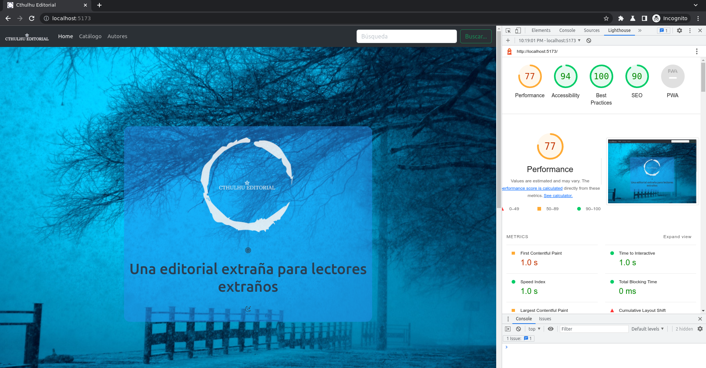

# cthulhu_editores

### Rafael Ivorra

### Proyecto UNIFICADO para las asignaturas DIW y DWEC

### 2º curso de DAW

En líneas generales, el proyecto presenta un modelo para el _frontend_ de la página web de una editorial independiente.

Los dos _frameworks_ de desarrollo utilizados son Vue y Bootstrap.

1. Parte de Diseño de Interficies Web.

   1. Vue.

      - Desarrollo de la estructura básica con Vue y Vue router. La SPA se divide entre diferentes vistas y componentes, que reciben sus respectivas URLs a través de Vue router. Esto permite que las diferentes vistas puedan ser visitadas sin necesidad de recargar la página.

      - Cuenta con las siguientes páginas:

        a) _Landing page_, o _Home_. Incluye un carrusel (importado desde un componente) con los últimos titulos editados.

        b) Vista general de todos los libros. Haciendo click sobre cualquiera de los títulos, se accede a la vista siguiente.

        c) Vista unitaria para cada libro, con descripción ampliada de cada título.

        d) Página de autores.

        e) Página "Acerca de".

        f) Política de privacidad.

        g) Página de _login_ para el administrador. Las páginas siguientes son accesibles desde aquí. Esta página y las siguientes tienen sus rutas protegidas con autentificación mediante credenciales guardadas en el archivo JSON.

        h) Página de vista de libros para su edición.

        i) Página de creación de nuevo libro.

        j) Página de edición de libro.

        k) Página de eliminación de libro.

      - Uso de componentes para modularizar la aplicación. Se utilizan componentes independientes para _header_ y _footer_, así como para las _cards_ de los libros, el carrusel de libros, y los libros individuales.

   2. Bootstrap.

      - Se ha utilizado la última versión disponible de Bootstrap (5.3.0-alpha1).

      - Componentes utilizados: _cards_, carrusel, _navbar_, _badges_, _buttons_.

      - Las utilidades han sido numerosas: márgenes, anchos y altos de página, rellenos (_padding_), texto, espaciado, _flexbox_, _grid_, bordes y redondeo de bordes, colores, texto...

      - Se ha conseguido la adaptación de las páginas a dispositivos con diferentes _viewports_ mediante el uso de etiquetas de Bootstrap al efecto. Todas las páginas son *responsive*, esto es, adaptan su formato dependiendo del tamaño del *viewport*.

   3. Multimedia y diseño.

      - Las imágenes se muestran siempre de manera adecuada, sin deformaciones. Han sido editadas para adaptarse al marco en el que debían ser mostradas. Se han utilizado algunas imágenes en formato SVG, tanto de Bootstrap Icons como de unDraw. Otras imágenes decorativas (fondos) han sido tomadas de Unsplash. Las portadas para los libros han sido creadas individualmente con Canva.

      - En el carrusel aparecen tres imágenes, con, supuestamente, los últimos títulos publicados por la editorial. Las imágenes han sido editadas para este marco en concreto.

      - La paleta de colores es la básica de Bootstrap, definida con sus clases principales.

      - Los criterios para UX/UI han sido seguidos, según directrices aprendidas durante el primer trimestre.

      - Lighthouse muestra un 77-78% de rendimiento, sin que haya sido posible mejorar este dato.

      

   4. Extensiones

      - Han sido creadas más páginas de las requeridas.

      - Las posibilidades de Vue han sido utilizadas para crear distintos _arrays_ dinámicos tanto de libros como de autores y, anidados en estos, sus obras. De este modo, al añadir los datos de un nuevo libro o autor, este pasará a ser incluido automáticamente en su vista respectiva.

      - Se han utilizado cookies para proteger las rutas de administración. Al hacer *login* con las credenciales correctas (devueltas mediante una petición a la *fake* API), se crea una cookie. Si la cookie no está presente al intentar acceder a alguna de las rutas de administración (/admin, /edit/:id, /create, /delete/:id), la web redirecciona a la vista de /login.

2. Parte de Desarrollo Web en Entorno Cliente.

   1. Vue.

      - Se han empleado, entre otras, las siguientes posibilidades que ofrece Vue:

        - Declarative rendering {{ }}

        - Binding (v-bind)

        - List Rendering (v-for)

        - 2-way Binding (v-model)

        - Components Event “click”

        - Methods

    2. CRUD.
    
        - A través de la vista de administrador, tras hacer *login* con las credenciales adecuadas, se tiene acceso a operaciones asíncronas de lectura, creación, edición y eliminación de los datos de los libros contenidos en el JSON.

    3. API.
    
        - La API utilizada ha sido la *fake* API servida por la aplicación json-server.

    4. Diseño.
    
        - El diseño de las vistas de administrador aprovecha las clases de Bootstrap e imágenes SVG para mejorar los aspectos de UI/UX.

    5. Ampliaciones.

        - Las operaciones CRUD se realizan con funciones async/await de JavaScript.

        - El encadenamiento de instrucciones asíncronas se incluye, por ejemplo, en la vista de Login, donde se encadenan funciones asíncronas mediante async/await.

